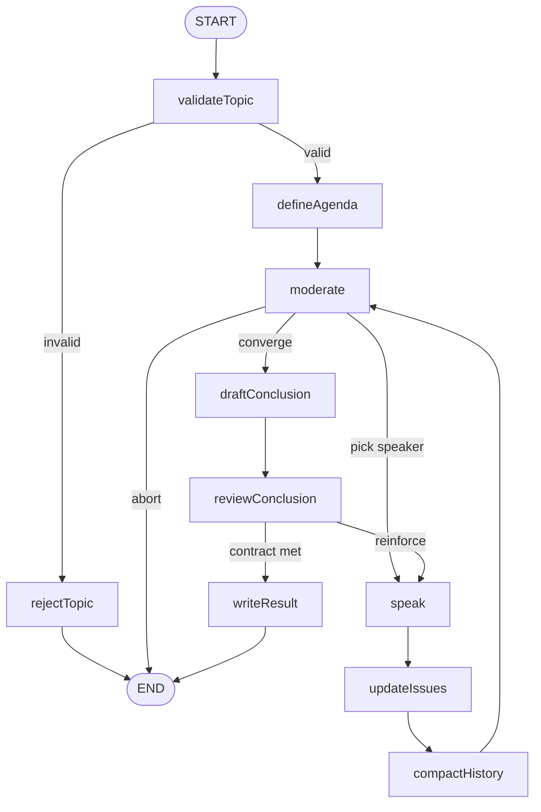
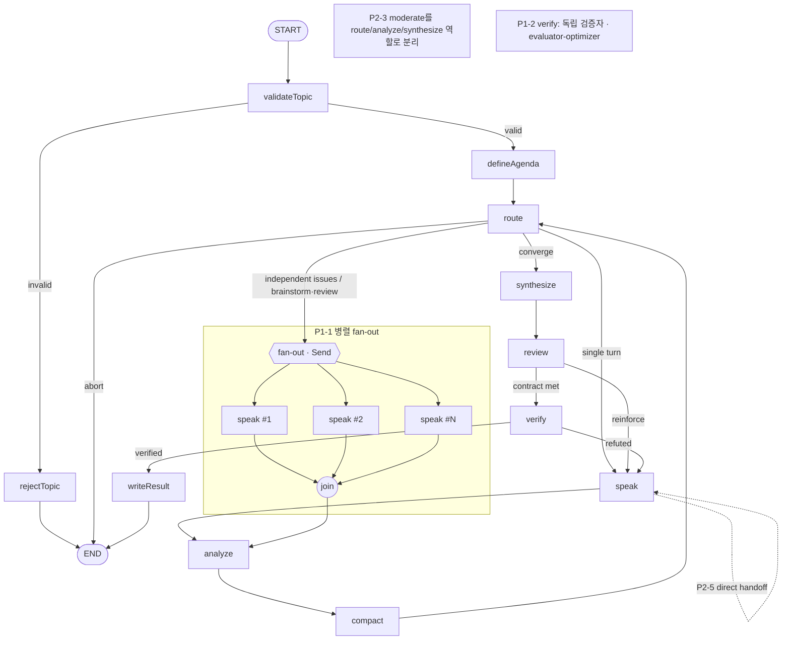

# Discuss 그래프 — Multi-Agent 관점 개선안

## 0. 이 문서의 목적

`OrchestratorService`의 토론(discuss) 그래프를 **multi-agent 관점에서 어떻게 개선할 수 있는지** 정리한다. 먼저 현재 구조가 공식 정의상 무엇인지 규정하고, 부족한 부분(갭)을 짚은 뒤, 개선안 7개를 우선순위(P1~P3)·근거·코드 접점·트레이드오프와 함께 제시한다. 마지막으로 이 개선이 프론트엔드 UI에 주는 영향을 다룬다.

> 대상 코드: `apps/be/src/orchestrator/` (그래프·노드), `apps/fe/src/components/RoomDiscussView.tsx` (렌더링)

---

## 1. 현재 구조 진단

### 1.1 무엇으로 만들어졌나

`orchestrator.service.ts`는 `@langchain/langgraph`의 `StateGraph`와 `Command(goto)` 라우팅으로 만들어진 **상태 그래프**다. 노드는 모두 `OrchestratorService`의 메서드이고, 공유 상태는 `DiscussionState`(`discussion-state.ts`)다. LLM을 호출하는 주체는 두 종류뿐이다.

- **`ModeratorService`** — 단일 "감독" LLM. `validateTopic` / `defineAgenda` / `pickSpeaker`(라우팅) / `updateIssues`(쟁점 추출) / `draftDecision` / `summarizeHistory`를 **전부** 담당한다. 즉 누가 말할지 정하고 토론 상태를 관리하는 오케스트레이터다.
- **`SpeakerService`** — 실제 발언자(agent). 매 턴 한 명의 `RoomAgentSpec`이 발언하며, 각자 고유한 페르소나 프롬프트(`prompts.agent`), 자체 도구(`buildToolsForAgent` → 현재 `rag_search`만), 자체 모델(`agent.model`), 자체 도구 루프(`maxToolIterations`)를 가진다.

### 1.2 공식 정의로 분류하면

Anthropic *Building Effective Agents*는 **workflow**("LLM·도구가 *사전 정의된 코드 경로*로 오케스트레이션됨")와 **agent**("LLM이 스스로 자기 프로세스·도구 사용을 동적으로 통제")를 구분한다. 이 기준으로 현재 그래프는 세 가지 workflow 패턴의 조합이다.

- **prompt-chaining** (고정 백본): `validateTopic → defineAgenda → … → writeResult`로 흐르는 정해진 단계.
- **routing**: `pickSpeaker`가 다음 발언자를 동적으로 선택.
- **orchestrator-workers**: moderator(오케스트레이터)가 speaker(worker)들에게 발언을 위임.

정리하면 현재 시스템은 **"LLM 오케스트레이터가 여러 도구-사용 agent를 조율하는 multi-agent 워크플로우"**다. LangGraph 용어로는 supervisor 아키텍처에 해당해 "multi-agent"라 부를 수 있지만, multi-agent가 실제로 주는 이득의 상당수는 비어 있다.

### 1.3 비어 있는 multi-agent 이득(갭)

| 갭 | 현재 상태 | 근거 |
| --- | --- | --- |
| **병렬화** | 엄격한 순차 턴제(1턴=1발언) | `moderate → speak` 단일 경로 |
| **독립 검증** | 결론을 moderator가 self-draft, 검증 루프 없음 | `inconsistencies`가 "검증 필요" 메모로만 첨부 (`conclusion-writer.service.ts:35-42`) |
| **관심사 분리** | moderator 단일 LLM이 6개 역할 겸임 | `moderator.service.ts` |
| **능력 다양성** | 모든 agent가 동일하게 `rag_search`만 보유 | `agent-tools.ts`의 `BUILDERS`에 단일 항목 |
| **분리된 컨텍스트** | 전원이 단일 공유 transcript+summary만 참조 | `discussion-context.ts` |

> ⚠️ **비용 전제**: Anthropic 측정상 agent는 chat 대비 ~4×, multi-agent는 ~15× 토큰을 쓴다. 아래 개선(특히 P1)은 반드시 토큰/비용 가드레일과 함께 도입해야 한다.

---

## 2. 개선 항목 요약

| # | 개선 | 공식 패턴 | 핵심 효과 | 난이도 |
| --- | --- | --- | --- | --- |
| P1-1 | 병렬 sub-agent fan-out | parallelization (sectioning) | 독립 쟁점 동시 처리 → 속도·커버리지 | 中~高 |
| P1-2 | 독립 verifier 노드 | evaluator-optimizer | 산술/단위/모순 적대 검증 → 결론 신뢰도 | 中 |
| P2-3 | `moderate` 역할 분리 | routing | route/analyze/synthesize 프롬프트 특화 | 中 |
| P2-4 | 역할별 이질적 도구 | tool design | rag_search 외 계산기 등 능력 다양화 | 低~中 |
| P2-5 | agent 직접 handoff | LangGraph handoff | yield를 힌트가 아닌 실제 위임으로 | 中 |
| P3-6 | agent별 사설 메모리 | separate context | 페르소나 일관성·재유도 감소 | 中 |
| P3-7 | 모델 계층화 | Opus lead + Sonnet sub | 강모델은 감독/검증에, 발언자는 저렴하게 | 低 |

---

## 3. 개선안 상세

### P1-1. 병렬 sub-agent fan-out — parallelization (sectioning)

- **현재**: 한 번에 한 명만 발언한다(`moderate → speak → analyze → compact → moderate` 루프). 서로 독립적인 소주제·쟁점도 직렬로 처리돼 느리고 커버리지가 좁다.
- **개선**: `discussionType`이 `brainstorm`/`review`이거나 서로 독립인 `issues`에 대해, 여러 agent를 **동시에** 발언시키고 합류 노드에서 결과를 모은다. LangGraph `Send` API로 fan-out 후 `join`에서 합류한다.
- **근거**: Anthropic parallelization(sectioning)·orchestrator-workers. multi-agent research 사례에서 lead가 subagent 3~5개를 동시 spawn해 복잡 쿼리 시간을 최대 90% 단축했다.
- **코드 접점**: `orchestrator.service.ts`(그래프에 병렬 `speak` 분기 + `join` 노드 추가). `discussion-state.ts`의 `issues`(merge-by-id)·`participantStats`(누적) reducer가 이미 동시 쓰기에 적합해 충돌이 작다.
- **주의**: 같은 issue를 동시에 건드리면 머지 순서가 비결정적이 될 수 있다. 병렬은 **독립 쟁점에만** 한정한다. `recursionLimit`(`orchestrator.service.ts:61`) 재계산 필요.

### P1-2. 독립 verifier 노드 — evaluator-optimizer

- **현재**: `inconsistencies`(arithmetic/unit/contradiction)는 `conclusion-writer.service.ts:35-42`에서 "수치 검증 필요" 메모로 붙기만 하고 **실제 검증은 하지 않는다**. 결론은 moderator가 스스로 작성하므로 독립적인 평가가 없다.
- **개선**: `writeResult` 직전에 **독립 verifier agent** 노드를 둔다. `decisionCandidate`와 미해소 `inconsistencies`를 적대적으로 검증하고, 반박 시 `speak`로 되돌리는 평가 루프를 만든다.
- **근거**: evaluator-optimizer 패턴("한 LLM이 생성, 다른 LLM이 평가·피드백 루프")은 명시적 평가기준이 있을 때 가장 효과적인데, 이미 `DecisionCandidate` 계약(`convergence-policy.service.ts`의 `contractSatisfied`)이 그 기준 역할을 한다. multi-agent research의 후처리 CitationAgent와도 같은 결.
- **코드 접점**: 신규 `VerifierService`, 그래프 `review`↔`writeResult` 사이 노드. 기존 규칙 기반 수렴(`convergence-policy.service.ts`)을 보완한다.

### P2-3. `moderate` 역할 분리 — routing

- **현재**: `moderator.service.ts`의 단일 LLM 정체성이 validate/agenda/route/issue추출/draft/summarize를 **모두** 수행한다(god-orchestrator). `ConclusionWriter`·`SpeakerSelector`로 서비스는 분리됐지만 결국 같은 moderator LLM 호출을 감쌀 뿐이다.
- **개선**: 책임별로 **집중된 프롬프트/정체성**으로 분리한다 — `route`(발언자 라우팅) / `analyze`(issue·inconsistency 추출) / `synthesize`(결론). 각 호출의 컨텍스트·지시가 좁아져 정확도가 오른다.
- **근거**: routing 패턴의 핵심 이득 "관심사 분리, 더 특화된 프롬프트" + Anthropic 원칙 "teach orchestrators to delegate".
- **코드 접점**: `moderator.service.ts` 메서드 재편, 프롬프트는 `prompts.ts`. 그래프 노드 이름도 `moderate→route`, `updateIssues→analyze`, `draftConclusion→synthesize`로 정렬.

### P2-4. 역할별 이질적 도구 — tool design

- **현재**: 모든 agent가 `rag_search` 하나만 쓴다(`agent-tools.ts`의 `BUILDERS`에 단일 항목). `RoomAgentSpec.tools`/`maxToolIterations`는 이미 배선돼 있다.
- **개선**: 역할별로 다른 도구를 부여한다. 특히 **계산기/수치검증 도구**는 P1-2 verifier의 산술 inconsistency 검증에 직결되고, 필요 시 외부 조회 등을 추가한다.
- **근거**: Anthropic 원칙 "도구를 신중히 설계 — 명확하고 구별되는 목적". multi-agent의 이득은 본질적으로 **이질적 능력**에서 나온다.
- **코드 접점**: `agent-tools.ts`의 `BUILDERS` 확장, 신규 도구 모듈.

### P2-5. agent 직접 handoff — LangGraph handoff

- **현재**: agent의 `yieldTo`는 **힌트**일 뿐이고, supervisor가 override할 수 있다(`speaker-selector.service.ts:81-93`의 `passTurnTarget`).
- **개선**: 신뢰도 높은 yield는 handoff 도구 호출로 **다음 발언자를 직접 지정**한다(LangGraph handoff = `Command(goto)` 반환, network/swarm 패턴). supervisor 라우팅과 공존시키되 우선순위를 정의한다.
- **근거**: LangGraph multi-agent handoff. agent가 자기 실행 경로를 통제한다는 자율성 측면.
- **코드 접점**: `speak` 결과가 `Command`를 반환하는 경로, `speaker-selector`의 override 정책.

### P3-6. agent별 사설 메모리 — separate context

- **현재**: 모든 agent가 단일 공유 transcript+`historySummary`만 본다. agent별 사설 스크래치패드가 없다(`discussion-context.ts`).
- **개선**: agent별 누적 노트(예: `agentMemory: Record<string, string>`)를 상태에 추가해 `prompts.agent`에 주입한다. 페르소나 일관성이 오르고 재유도가 줄며 토큰 압력이 완화된다.
- **근거**: multi-agent research의 "subagent별 분리된 컨텍스트 윈도우" + "lead가 plan을 memory에 저장".
- **코드 접점**: `discussion-state.ts`(annotation 추가), `prompts.ts`(주입).

### P3-7. 모델 계층화 — Opus lead + Sonnet sub

- **현재**: moderator와 agent가 모두 `resolveModel()` 또는 `agent.model`을 쓰며 의도적 계층이 없다.
- **개선**: 오케스트레이터/verifier에는 **강한 모델(Opus)**, 일상 발언자에는 **저렴한 모델(Sonnet/Haiku)**을 배치해 ~15× 비용을 완화하면서 품질을 유지한다.
- **근거**: multi-agent research = Opus lead + Sonnet subagents 조합이 단일 Opus 대비 90.2% 우수.
- **코드 접점**: `prompts.ts`의 `resolveModel`, `RoomAgentSpec.model` 정책.

---

## 4. 그래프 구조

### 4.1 현재 그래프

흐름: 주제 검증 → 안건 정의 → (발언 → 쟁점추출 → 히스토리 압축)을 수렴 조건까지 반복 → 결론 초안 → 검토 → 결과 작성. 발언은 항상 한 명씩 순차다.

### 4.2 개선 후 그래프 (P1~P3)

토폴로지 차이 3가지:
1. `route` 다음에 병렬 `speak#1..N → join` 신설 (P1-1). 단일 발언 경로는 유지하고 독립 쟁점일 때만 분기.
2. `review` 뒤에 `verify` 노드 + `speak` 회귀 루프 신설 (P1-2). 현재는 review→writeResult 직결.
3. `moderate`의 단일 책임이 `route`/`analyze`/`synthesize` 세 정체성으로 분할 (P2-3).

### 4.3 노드 매핑 (현재 → 개선)

| 현재 노드 | 개선 후 | 비고 |
| --- | --- | --- |
| `moderate` | `route` | 라우팅 책임만 (P2-3) |
| `updateIssues` | `analyze` | issue/inconsistency 추출 (P2-3) |
| `compactHistory` | `compact` | 동일 |
| `draftConclusion` | `synthesize` | 결론 합성 (P2-3) |
| `reviewConclusion` | `review` | 동일 |
| (없음) | `fan-out` / `join` | 병렬 발언 분기·합류 (P1-1) |
| (없음) | `verify` | 독립 검증자 노드 (P1-2) |

> 그래프에 표기되지 않는 변경: 역할별 이질적 도구(P2-4, `speak` 내부 도구 루프), agent별 메모리(P3-6, 상태 필드), 모델 계층화(P3-7, 설정).

---

## 5. UI 영향 (apps/fe)

### 5.1 현재 UI 구조

토론 UI(`apps/fe/src/components/RoomDiscussView.tsx`)는 **단일 세로 타임라인 + "한 번에 한 명만 발언" 전제**로 작성돼 있다. SSE 이벤트를 `consumeStream`이 파싱해 `items: DisplayItem[]` 한 배열에 시간순으로 쌓는다.

| 이벤트 | 처리 | 라인 |
| --- | --- | --- |
| `turn_start` | 새 turn을 `items` **맨 끝에** append (`done:false`) | `:140` |
| `content` | 뒤에서부터 `agentId && !done`인 turn을 찾아 텍스트 누적 | `:163` |
| `turn_end` | **마지막 item(`prev.length - 1`)**을 done 처리 | `:155` |
| `status` | `pickSpeaker`만 인라인 note, 나머지는 단일 status 줄 | `:223` |

핵심 가정: "지금 스트리밍 중인 발언은 항상 배열의 마지막 하나"라는 전제가 `turn_end` 로직에 박혀 있다. 발언 블록도 단일 컬럼(`max-w-2xl` 세로 스택, `:481`)으로만 렌더된다.

### 5.2 개선 항목별 UI 영향

| 개선 | UI 영향 | 필요 작업 |
| --- | --- | --- |
| **P1-1 병렬 fan-out** | **변경 필수 (큼)** | ① `turn_end`가 "마지막 item" 기준이라 동시 발언 시 엉뚱한 turn을 종료시킴 → **agentId 기준**으로 수정. ② `content`는 agentId로 라우팅되나, 단일 컬럼에 두 발언이 청크 교차로 쌓여 **시각적으로 뒤섞임** → 라운드 그룹 또는 레인(컬럼) 레이아웃 신설. ③ "T{round} · N명 동시 발언" 그룹 헤더 등 |
| **P1-2 verify** | 경미 | 새 phase `verify`는 코드 변경 없이 status 줄에 detail로 자동 표시됨. 전용 배지/note는 선택. 반박→speak 회귀는 turn이 더 쌓일 뿐 구조 영향 없음 |
| **P2-3 route/analyze/synthesize** | 경미 | phase 문자열 `pickSpeaker`가 하드코딩(`:223`)됨. route가 다른 phase명을 쓰면 note 렌더가 깨짐 → 문자열 갱신 |
| **P2-5 handoff** | 선택 | `passTurn` 이벤트는 제거됨. 핸드오프를 시각화하려면 이벤트·FE 분기를 재도입 |
| **P2-4 도구 / P3-6 메모리 / P3-7 모델** | 거의 없음 | 도구는 이미 `MessageMeta`로 렌더, 메모리는 내부 상태, 모델은 선택적 배지 정도 |

> **결론**: UI 변경의 대부분은 **P1-1**에서 발생한다. 현 타임라인이 단일 활성 발언자를 코드 수준(`turn_end`의 `prev.length-1`)에서 전제하므로, 병렬 발언을 도입하면 백엔드뿐 아니라 FE 렌더링 로직과 레이아웃도 함께 바꿔야 한다. 나머지 개선은 UI에 경미하거나 선택적이다.

---

## 6. 권장 도입 순서

1. **P2-3(moderate 분해) + 토큰 가드레일** — 위험 낮고 구조를 정리. (UI: phase 문자열만 갱신)
2. **P1-2(verifier)** — 단일 노드 추가로 결론 신뢰도 확보. (UI: 거의 없음)
3. **P1-1(병렬 fan-out)** — 이득이 가장 크지만 그래프·상태·**UI를 함께** 바꿔야 하므로 가드레일·동시성 설계 이후. (UI: 대규모)
4. **P3-6/P3-7, P2-4/P2-5** — 점진 적용.

> ⚠️ P3까지 단독 도입(P4 비용 가드레일 없이)은 비용 폭주 위험이 있어 권장하지 않는다.
