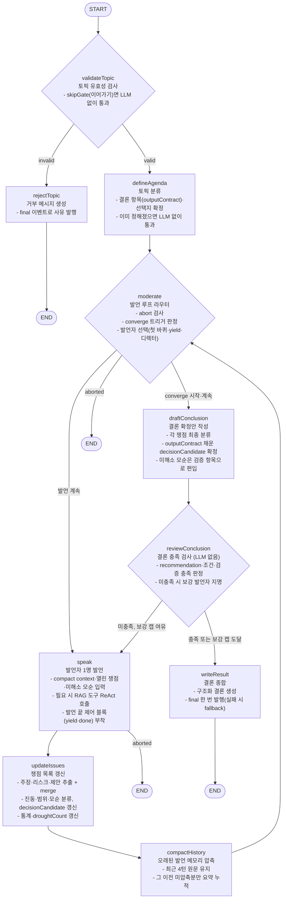

# Discuss 동작 원리

여러 AI 에이전트가 **턴 단위로 발언권을 주고받으며** 토론하고, 모더레이터가 쟁점을 목록으로 관리하다가 실행 가능한 결론으로 종합하는 멀티 에이전트 토론 기능이다. 핵심 메커니즘은 세 가지다.

- **하이브리드 발언권** — 발언한 에이전트가 다음 발언자를 직접 지목(발언권 넘김)하고, 지목이 없거나 교착될 때만 디렉터(모더레이터 LLM)가 개입한다.
- **단일 supervisor 라우팅** — 모든 제어 결정은 `moderate`(발언자 선택/converge 시작)와 `reviewConclusion`(결론 게이트) 두 노드에만 모이고, 작업 노드는 전부 `moderate`로 복귀한다. 라우팅은 LangGraph `Command({ goto })`로 코드에 명시한다.
- **계약 기반 converge** — 매 턴 쟁점 목록(issues)과 권고안 후보(decision candidate)를 갱신하고, 결론 필수 항목(`outputContract`)이 충족되면 종료한다.

모든 발언은 RxJS `ReplaySubject<RoomEvent>`(구독 측 `Observable`)를 통해 SSE로 실시간 스트리밍된다.

> LangChain 대응: 모더레이터 `moderate`가 **Supervisor/Router**, 에이전트의 `yield`가 **Handoffs**, LangGraph `StateGraph`가 **Custom Workflow**. 에이전트 발언권 넘김은 감독자(`moderate`)를 거치게 두고, 노드 간 제어 이동은 supervisor 자신의 `Command(goto)`로만 표현한다.

---

## 그래프 구조



`validateTopic`으로 토픽을 검사하고, `defineAgenda`가 토픽을 분류해 결론 항목을 정한다. 이후 `moderate → speak → updateIssues → compactHistory → moderate` 루프를 돌며 한 턴에 한 명씩 발언한다. converge 조건(턴 상한·디렉터 종료·정체·진동)이 충족되면 `moderate`가 `converging`을 켜고 `draftConclusion`이 결론 확정안을 만든다. `reviewConclusion`이 `outputContract` 충족을 검사해 `writeResult`로 종료하거나, 미충족이면 발언자를 골라 한 턴 더 보강한다(최대 1회). 모든 의사결정 노드(`validateTopic`·`moderate`·`reviewConclusion`)는 `Command({ goto })`로 다음 노드를 직접 지정한다.

---

## State

LangGraph `Annotation.Root`로 정의한다. reducer는 `turnLog`만 concat, `issues`·`inconsistencies`는 id 기준 merge(`mergeById`), `participantStats`는 필드별 누적 합산(`mergeStats`), 나머지는 덮어쓰기다. `turnLog`는 저장용 원문을 보존하고, LLM 프롬프트에는 `historySummary + 최근 발언 원문` compact context(`buildDiscussionContext`)를 쓴다. 제어 흐름은 State 필드가 아니라 의사결정 노드의 `Command(goto)`로 표현하므로 라우팅 전용 필드(`phase`·`topicValid`·`finished`)는 두지 않는다.

```typescript
{
  turn:           number,        // 누적 발언 턴 수
  turnLog:        TurnEntry[],   // 누적 대화록 (concat)
  aborted:        boolean,       // 중단 요청 감지
  nextSpeakerId:  string|null,   // 이번 턴 발언자 (moderate → speak)
  pendingYield:   string|null,   // 직전 발언자가 지목(yield)한 다음 발언자
  yieldStreak:    number,        // 연속 yield 횟수
  lastDone:       boolean,       // 직전 발언자의 종료 제안
  historySummary: string,        // 오래된 발언 압축 메모리
  summarizedUntilTurn: number,
  discussionType: DiscussionType,// 'decision'|'review'|'brainstorm'|'risk_check'
  outputContract: string[],      // 결론 필수 항목
  options:        string[],      // 이진·대립 안건의 핵심 선택지
  issues:         Issue[],       // 쟁점 목록 (id merge)
  inconsistencies: Inconsistency[], // 수치·정합성 모순 목록 (id merge)
  participantStats: Record<string, ParticipantStat>, // 참가자별 누적 통계
  converging:     boolean,       // converge 단계 진입 여부 (발언 압박 문구 산출에도 사용)
  decisionCandidate: DecisionCandidate|null,
  droughtCount:   number,        // 새 주장 없이 흐른 연속 턴 수
  resolveRetries: number,        // reviewConclusion이 보강을 요구한 횟수
}
```

> `lastSpeakerId`는 별도 필드 대신 `turnLog`의 마지막 agent 발언에서 파생한다(`lastSpeakerId(turnLog)` 헬퍼).

```typescript
interface Issue {
  id: string; title: string; status: 'open'|'decidable'|'needs_verification'|'out_of_scope';
  claims: string[]; risks: string[]; proposals: string[];
  ownerRole?: string; lastTouchedTurn: number; revisits: number;
}
interface Inconsistency {
  id: string; description: string; kind: 'arithmetic'|'unit'|'contradiction';
  turn: number; resolved: boolean;
}
interface DecisionCandidate {
  recommendation: string; conditions: string[]; risks: string[]; verification: string[];
}
interface ParticipantStat { turns: number; newClaims: number; repeatClaims: number; }
```

> `TurnEntry.round`와 DB `Message.round`는 라운드가 아니라 **턴 인덱스**를 담는다(스키마 마이그레이션 회피).

---

## 노드

| 노드 | 핵심 동작 | 분기 |
|---|---|---|
| **validateTopic** | 토픽 유효성 검사. `skipGate=true`(이어가기)면 LLM 없이 통과. | `Command`: valid→`defineAgenda`, invalid→`rejectTopic` |
| **rejectTopic** | 거부 사유를 `final` 이벤트로 발행(`content` 없음). | →END |
| **defineAgenda** | 토픽 분류 + `outputContract`/`options` 확정. `decision` 유형이거나 항목 미정 시 고정값 `DECISION_CONTRACT`(권고안·채택 조건·호환/이행·리스크 분류·검증 항목). 이미 채워졌으면 LLM 없이 통과. | →`moderate` |
| **moderate** | 유일한 발언 루프 라우터. abort 검사 → `converging`이면 `draftConclusion` → `shouldConverge()`(턴캡·정체·진동) 충족 시 converge 시작 → 아니면 `selectSpeaker()`로 발언자 지명. | `Command`: →`speak`/`draftConclusion`/END |
| **speak** | 발언자 1명이 compact context·참가자 명단·열린 쟁점·미해소 모순을 받아 발언. 필요 시 `buildToolsForAgent`로 조립된 도구를 `maxToolIterations`회까지 ReAct 호출. 발언 끝에 **제어 블록** 부착(아래 참고). | →`updateIssues` |
| **updateIssues** | 발언에서 주장·리스크·제안 추출 → 쟁점 목록 갱신. 의미 같으면 merge(`repeatClaims`), 새로우면 `newClaims`. 진동/범위 이탈/수치 검증 분류, `decisionCandidate` 점진 갱신, `participantStats`·`droughtCount` 갱신. | →`compactHistory` |
| **compactHistory** | 최근 4턴은 원문 유지, 그보다 오래된 미압축 발언만 `historySummary`로 누적(최대 1,500자). | →`moderate` |
| **draftConclusion** | 각 쟁점을 최종 분류하고 `outputContract`를 모두 채운 `decisionCandidate` 확정. 미해소 모순은 `verification`에 편입. | →`reviewConclusion` |
| **reviewConclusion** | 결론 충족 검사(LLM 없음). recommendation 비지 않음 + hedge 아님(`isCommitted`) + (decision이면 조건·검증 각 1개↑). 미충족이면 `selectSpeaker()`로 보강 발언자 지명. | `Command`: 충족/캡 도달→`writeResult`, 아니면 →`speak` |
| **writeResult** | compact context·확정 권고안·쟁점으로 구조화 결론 생성. `content` 미발행, 완료 후 `final` 한 번. 실패 시 fallback(`summary_degraded`). | →END |

### moderate 라우팅 순서

`moderate`는 발언 루프의 유일한 의사결정 노드다. LLM 호출을 최소화하도록 순서대로 판단한다.

1. **중단 검사** — `signal.aborted`이거나 `state.aborted`이면 `Command(goto: END)`.
2. **converge 진행** — `converging`이 이미 켜져 있으면 `Command(goto: draftConclusion)`(보강 발언 복귀 포함).
3. **converge 트리거**(`shouldConverge`) — 턴 상한(`turn >= maxTurns`, 발언 1건 이상)·정체(`droughtCount >= 2`)·진동(`revisits >= 3`) 중 하나면 `converging=true` 후 `draftConclusion`.
4. **발언자 선택**(`selectSpeaker`) — 세 전략을 순서대로 호출:
   - **첫 바퀴**(`firstPassPick`) — `!converging`이고 `turn < initialTurn + 참가자수`면 미발언자를 순서대로 지명(핵심 역할 시딩).
   - **yield 우선**(`passTurnTarget`) — `pendingYield`가 실재 id·자기지목 아님(`lastSpeakerId(turnLog)`)·`yieldStreak < 3`·새 기여 가능(반복 전담자 `repeatClaims > newClaims` 차단)이면 LLM 없이 지명. 가드에 막히면 디렉터로.
   - **디렉터 개입**(`directorPick`) — `moderator.pickSpeaker` 호출. `done`/`next=null`이면 converge(단 발언 0건이면 **바닥 가드**로 발언자 지명). 유효한 `next`면 지명 + `yieldStreak` 리셋.
   - 발언자를 고르면 `Command(goto: speak)`, converge 신호면 `converging=true` 후 `Command(goto: draftConclusion)`.

> 보강 1턴(`reviewConclusion`이 미충족 판정 시)도 같은 `selectSpeaker()`로 발언자를 골라 `speak`로 보낸다. 이때 `converging`은 켜진 상태라 발언 복귀 후 `moderate`는 곧장 `draftConclusion`으로 라우팅한다.

---

## 발언권 넘김 제어 블록

각 에이전트는 발언 끝에 다음 제어 블록을 덧붙인다(사용자에게 노출 안 됨).

````
```control
{"yieldTo": "<듣고 싶은 참가자 id 또는 null>", "passReason": "<지목 이유 또는 null>", "done": <마무리 가능하면 true>}
```
````

- `yieldTo` — 특정인을 지목하거나 `null`(플로어 개방).
- `done` — 디렉터에 `lastDone`으로 전달돼 종료 판단 힌트가 된다.

발언권 넘김은 에이전트가 *요청*하고 감독자(`moderate`)가 가드를 거쳐 *승인/거부*하는 계약이다. `SpeakerService`가 스트리밍 중 제어 블록 시작 토큰(`` ```control ``)을 감지해 이후 텍스트를 버퍼링하고 `{ content, yieldTo, passReason, done }`로 분리한다. 누락/파싱 실패 시 `{ yieldTo: null, passReason: null, done: false }`.

---

## converge 트리거

- **moderate / `shouldConverge`** — 턴 상한 도달(`turn >= maxTurns`) / 정체 누적(`droughtCount >= 2`) / 진동(`revisits >= 3`). 하나라도 충족되면 `converging=true`로 `draftConclusion` 진입.
- **moderate / `directorPick`** — 디렉터가 `done`/`next=null` 판단 시 converge(발언 0건이면 바닥 가드로 발언자 지명).
- **reviewConclusion** — 결론 충족 또는 `resolveRetries >= 1` → 최종 종료. 미충족·여유 있으면 보강 발언 한 턴 더(최대 1회, `RESOLVE_RETRY_CAP=1`).
- **교착 방지** — yield가 `MAX_CONSECUTIVE_YIELDS(3)`회 연속이면 무시하고 디렉터 개입. 반복 전담자로의 yield 차단.
- 모든 참가자가 발언할 필요는 없다. 일부만 발언하고도 종료할 수 있다.

---

## 토론 흐름 예시

```
[검증] validateTopic → valid → defineAgenda
[분류] defineAgenda  → 유형/결론 항목 확정 → moderate

[T1] moderate: explore 첫 바퀴 → 미발언자 A 지명 → speak
     speak: A 발언 → {yieldTo: "B"}
     updateIssues: 쟁점 perf 신설(newClaims=1), 정체 0 → compactHistory
[T2] moderate: 첫 바퀴 → 미발언자 B 지명(발언권 넘김 무관, 첫 바퀴 우선) → speak
     speak: B가 A 반박 → {yieldTo: null}
[T3] moderate: 발언권 넘김/디렉터로 C 지명 → speak
     speak: C 발언 → {yieldTo: "A"}; 새 주장 없음 → droughtCount=1
[T4] moderate: 발언권 넘김 적중 → A 재발언 → {done: true}
     updateIssues: 새 주장 없음 → droughtCount=2 → compactHistory
     moderate: shouldConverge(droughtCount>=2) → converging=true → draftConclusion

[converge] draftConclusion → reviewConclusion: 충족 → writeResult
[종합] writeResult → final 이벤트 → done
```

각 발언은 `turn_start → content(streaming) → turn_end` 순으로 이벤트가 발행되고, RAG 검색이 일어나면 그 사이 `tool`/`source`가 끼어든다.

---

## 저장 동작

- `beginDiscussion`(호환용)은 새 topic을 만들고 `beginTopicDiscussion`에 위임.
- `beginTopicDiscussion`은 기존 발언(`initialTurnLog`)과 직전 결론·요청 이력(`historySummary`)을 문맥으로 이어간다. 기존 발언 있으면 `skipGate=true`.
- 시작 시 topic을 `running`으로, `finalText`/`completedAt` 비우고 사용자 메시지 저장. 완료 시 이번 실행 신규 발언만 message로 저장, 마지막 모더레이터 발언을 `finalText`로, status를 `completed`(실패 시 `failed`).
- 저장 단위는 room 내부 topic. message는 `scope="topic"`, `refId=topic.id`. `Message.round`는 턴 인덱스.

---

## 비용 (턴당 LLM 호출)

- 발언권 넘김 적중 / explore 첫 바퀴: **발언 1회**(디렉터 없음).
- 지목 없거나 교착: **디렉터 1회 + 발언 1회**.
- 매 발언 직후 **쟁점 목록 갱신 1회**(`updateIssues`). 오래된 미압축 발언이 생기면 **메모리 압축 1회**(`compactHistory`).
- converge 시 **쟁점 해소 1회**(`draftConclusion`, 보강 시 1회 더) + **최종 요약 1회**(`writeResult`). `reviewConclusion`은 LLM 없음.
- 게이트(skip 시 0)·프레임(이어가기 시 0)은 시작 시 한 번씩.

목록·해소 호출로 LLM 횟수는 늘지만, 쟁점 중복을 억제하고 `outputContract`를 채울 때까지 converge를 보장해 결론 품질을 높인다.
